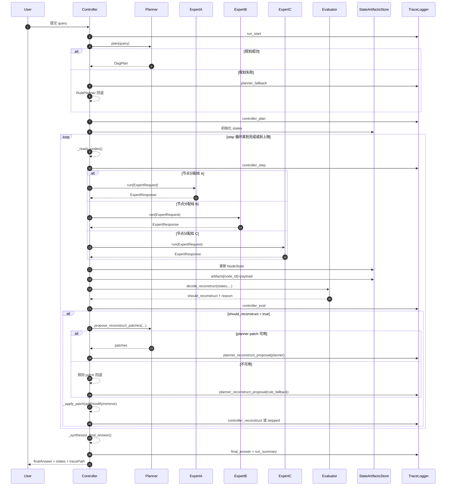

# 当前代码整体架构与沟通机制说明（中文版）

本文基于当前仓库实现，系统解释“代码如何运行、模型如何沟通、关键参数和函数是什么意思”。

---

## 1. 一句话总览

当前系统是一个**控制器驱动的多专家编排框架**：

- 控制器负责拆解任务、调度专家、评估状态、触发重构、汇总结果；
- 中心 Planner 模型负责初始 DAG 规划，并参与重构补丁提案；
- 专家 A/B/C 不直接互相对话，而是通过控制器写入和读取结构化中间结果完成协作。

---

## 2. 角色与职责（谁在做什么）

- **Controller（控制器，代码逻辑）**：[`orchestrator/controller.py`](/root/autodl-tmp/muti-llm/orchestrator/controller.py)
  - 负责主循环：`plan -> dispatch -> evaluate -> reconstruct -> finalize`
  - 维护运行状态（`states`）和中间结果仓库（`artifacts`）
- **Planner（中心规划器）**：[`orchestrator/planner.py`](/root/autodl-tmp/muti-llm/orchestrator/planner.py)
  - 生成初始 DAG（任务节点、依赖、预算）
  - 在重构阶段生成 patch（`add/remove/modify`）
- **Experts A/B/C（专家执行器）**：[`orchestrator/experts.py`](/root/autodl-tmp/muti-llm/orchestrator/experts.py)
  - A：事实检索和证据
  - B：推理和校验
  - C：最终表达和忠实输出
- **Evaluator（状态评估器）**：[`orchestrator/evaluator.py`](/root/autodl-tmp/muti-llm/orchestrator/evaluator.py)
  - 计算风险和不确定性，决定是否重构
- **Trace（可观测日志）**：[`orchestrator/trace.py`](/root/autodl-tmp/muti-llm/orchestrator/trace.py)
  - 记录全流程事件链（JSONL）

---

## 3. 系统真实运行时序图（当前代码）



---

## 4. “模型如何沟通”最核心的机制

模型之间不是直接发消息，核心是下面两步：

1. 专家执行后返回 `payload`（结构化结果）
2. 控制器保存：`artifacts[node_id] = payload`

之后，下游节点执行时，控制器根据 `input_refs` 从 `artifacts` 取上游结果，组装成 `context` 注入给下游专家。

可把 `artifacts` 理解为：

```json
{
  "T1": {"claims": ["..."], "sourceRefs": ["..."]},
  "T2": {"reasoningSteps": ["..."], "checkResult": "passed"},
  "T3": {"draft": "..."}
}
```

---

## 5. 协议对象与字段逐项解释（中文）

文件：[`orchestrator/protocol.py`](/root/autodl-tmp/muti-llm/orchestrator/protocol.py)

### 5.1 `TaskType`

- `retrieve`：检索型任务
- `reason`：推理型任务
- `write`：写作/表达任务
- `verify`：验证任务

### 5.2 `ExpertName`

- `A`：专家 A
- `B`：专家 B
- `C`：专家 C

### 5.3 `NodeStatus`

- `pending`：待执行
- `running`：执行中（当前实现很少显式使用）
- `done`：已成功完成
- `failed`：执行失败
- `skipped`：被跳过（常见于重构替换后旧节点）

### 5.4 `Budget`

- `max_tokens`：单节点最大 token 预算
- `max_seconds`：单节点最大运行时长预算
- `validate()`：校验预算必须大于 0

### 5.5 `TaskNode`

- `node_id`：节点唯一编号（如 `T1`）
- `task_type`：任务类型
- `expert`：执行专家
- `dependencies`：必须先完成的节点列表
- `input_refs`：执行时可读取哪些上游结果
- `budget`：该节点预算
- `to_dict()`：转为对外 JSON 结构（camelCase）

### 5.6 `DagPlan`

- `nodes`：节点列表
- `validate()`：
  - 至少有 1 个节点
  - 节点 ID 不重复
  - 每个依赖都必须存在
- `rewrite_dependency_refs(old_id,new_id)`：
  - 在重构时批量把依赖和输入引用从旧节点替换为新节点

### 5.7 `ExpertRequest`

- `run_id`：本次请求运行标识
- `node`：当前任务节点
- `query`：用户问题
- `context`：上游中间结果

### 5.8 `ExpertResponse`

- `node_id`：结果属于哪个节点
- `summary`：简短摘要
- `confidence`：置信度（0~1）
- `payload`：结构化内容（关键）
- `error_code`：错误码（非空时视为失败）
- `next_hint`：后续建议（可选）

### 5.9 `NodeState`

- `node_id`：节点编号
- `status`：当前状态
- `confidence`：节点置信度
- `risk_score`：节点风险分
- `uncertainty`：节点不确定性
- `artifact_ref`：指向结果仓库的引用（当前通常填 node_id）
- `error_code`：失败原因

### 5.10 `ReconstructPatch`

- `op`：重构操作（`add/remove/modify`）
- `target_node`：目标节点
- `reason`：重构原因
- `expected_gain`：预期收益分
- `cost_impact`：成本影响分
- `new_node`：新节点定义（`add/modify` 时使用）

---

## 6. Controller 主循环函数详解（中文）

文件：[`orchestrator/controller.py`](/root/autodl-tmp/muti-llm/orchestrator/controller.py)

### 6.1 `OrchestratorConfig` 参数解释

- `max_steps`：最大循环步数，防止无限运行
- `t_risk`：触发重构的风险阈值
- `t_uncertainty`：触发重构的不确定性阈值
- `cooldown_steps`：重构冷却步数，防止频繁抖动
- `max_reconstruct_times`：最多允许重构次数
- `max_patch_ops_per_round`：每轮最多应用多少 patch
- `reconstruct_budget_ratio`：重构预算占最大步数比例（用于双重限流）

### 6.2 `run(query)`

作用：系统总入口函数。  
关键流程：

1. 记录 `run_start`
2. 生成初始 DAG（失败则规则回退）
3. 初始化 `states` 和 `artifacts`
4. 进入 step 循环：
   - 找 ready 节点
   - 分发专家执行
   - 更新状态与产物
   - 评估是否重构
   - 如需重构则生成并应用 patch
5. 汇总答案、写 `final_answer`、写 `run_summary`
6. 返回最终结构化结果

### 6.3 `_dispatch_node(run_id,node,query,artifacts)`

作用：把节点发送给对应专家执行。  
关键点：

- 从 `input_refs` 取上下文：`context = {ref: artifacts.get(ref,{}) ...}`
- 记录 `expert_call` / `expert_result`
- 返回 `ExpertResponse`

### 6.4 `_update_state(state,response)`

作用：根据专家结果刷新节点状态。  
规则：

- `error_code` 非空：
  - `status=FAILED`
  - `confidence=0`
  - `risk_score=1`
  - `uncertainty=1`
- 否则：
  - `status=DONE`
  - `risk_score=1-confidence`
  - `uncertainty=1-confidence`
  - `artifact_ref=node_id`

### 6.5 `_ready_nodes(dag,states)`

作用：找当前可执行节点。  
条件：节点是 `pending` 且所有依赖都 `done`。

### 6.6 `_all_done(dag,states)`

作用：判断是否收敛完成。  
条件：所有节点都在 `done/skipped`。

---

## 7. Planner 规划与重构提案机制

文件：[`orchestrator/planner.py`](/root/autodl-tmp/muti-llm/orchestrator/planner.py)

### 7.1 `plan(query)`（初始 DAG）

- `OpenAIJsonPlanner` 会请求兼容 OpenAI 接口
- 期望返回严格 JSON 的 `nodes`
- 解析失败时会尝试从文本中截取 JSON

### 7.2 `propose_reconstruct_patches(...)`（重构提案）

输入包含：

- `query`
- `dag`
- `states`
- `max_patch_ops`
- `artifactsSummary`
- `failedNodePayloads`

当前实现增加了两段式：

1. 先调用 `_summarize_reconstruct_context()` 生成 `plannerContextSummary`
2. 再用 `plannerContextSummary + 状态/产物摘要` 生成补丁 JSON

### 7.3 patch 校验

- `parse_reconstruct_patches()` 会过滤非法 patch
- Controller 还会用 `_patch_applicable()` 二次过滤
- Planner 提案不可用时回退规则 patch

---

## 8. 专家执行、错误码与修复机制（重点）

文件：[`orchestrator/experts.py`](/root/autodl-tmp/muti-llm/orchestrator/experts.py)

### 8.1 专家请求格式

`OpenAIExpertAdapter._build_user_content()` 发送 JSON 字符串：

- `nodeId`
- `taskType`
- `query`
- `context`

### 8.2 专家结构化输出要求

- A：`claims/sourceRefs/citationConfidence` 等
- B：`reasoningSteps/verifications/checkResult`
- C：`draft/fidelityReport/unsupportedStatements`

### 8.3 错误码分类

- HTTP：`unauthorized/forbidden/endpoint_not_found/rate_limited/upstream_server_error...`
- 网络：`network_timeout/connection_refused/dns_resolution_failed/network_error`
- 内容：`empty_response`
- 结构：`invalid_json/invalid_schema`
- 调用：`call_exception`

### 8.4 `repair_once` 机制

当首轮输出结构不合法时：

1. 进入 `_repair_structured_payload(...)`
2. 用 repair prompt 要求“只输出合法 JSON”
3. 修复成功则节点成功（`completed after repair_once`）
4. 修复失败则返回 `repair_*` 错误码并判失败

---

## 9. Evaluator 重构触发规则

文件：[`orchestrator/evaluator.py`](/root/autodl-tmp/muti-llm/orchestrator/evaluator.py)

### 9.1 `aggregate_risk(states)`

- 失败比例 + 成功节点置信度共同计算
- 公式：`0.65*failure_ratio + 0.35*(1-avg_conf_done)`
- 若有失败节点，风险下限提升到 `0.76`

### 9.2 `aggregate_uncertainty(states)`

- 所有节点 `uncertainty` 平均值（限制在 0~1）

### 9.3 `decide_reconstruct(...)`

顺序判断：

1. 重构次数是否超上限
2. 是否在冷却期
3. 是否同时超过 `t_risk` 和 `t_uncertainty`

仅满足双阈值且未被预算/冷却挡住时，才返回 `should_reconstruct=True`。

---

## 10. Reconstruct 补丁如何生成与应用

### 10.1 提案来源优先级

1. Planner 提案（中心模型）
2. 规则回退提案（`_build_rule_reconstruct_patches`）

### 10.2 规则提案策略（当前实现）

- 优先 `MODIFY`：
  - 瞬时错误：提高预算（tokens/seconds）
  - schema 错误：可将 `REASON/VERIFY` 切到专家 C
- 其次 `REMOVE`：
  - 失败的重试叶子节点可剪枝
- 最后 `ADD`：
  - 新增 `*_retry` 节点重试

### 10.3 应用 patch

`_apply_patch()` 支持：

- `ADD`：追加新节点并改写引用
- `MODIFY`：原位替换节点并重置状态为 `pending`
- `REMOVE`：删除节点并修正依赖链

同时受限于：

- `max_patch_ops_per_round`
- `reconstruct_budget_ratio` 对应的成本上限

---

## 11. Trace 可观测事件（排障核心）

文件：[`orchestrator/trace.py`](/root/autodl-tmp/muti-llm/orchestrator/trace.py)

关键事件：

- `run_start`
- `controller_plan`
- `controller_step`
- `expert_call`
- `expert_result`
- `controller_eval`
- `planner_reconstruct_proposal`
- `controller_reconstruct`
- `controller_reconstruct_skipped`
- `final_answer`
- `run_summary`

每个事件都会写入全局 JSONL，且可选按 `runId` 分文件写入。

---

## 12. A 检索索引链路（离线）

### 12.1 主脚本

文件：[`build_retriever_a_faiss_index.py`](/root/autodl-tmp/muti-llm/build_retriever_a_faiss_index.py)

作用：从 `Data/Model_A` 多来源语料构建 FAISS 索引。

主要参数：

- `--checkpoint`：优先加载的 A 检索权重
- `--base-model`：checkpoint 失败时回退模型
- `--rag-root`：RAG 主语料目录
- `--output-dir`：输出目录（`index.faiss/docs.jsonl/meta.json`）
- `--gpu`：选择 GPU（通过 `CUDA_VISIBLE_DEVICES`）
- `--batch-size`：编码批大小
- `--max-docs`：测试时限制最大文档数
- `--include-ms-marco`：并入 MS MARCO
- `--include-hotpot-context`：并入 Hotpot context
- `--include-qa-pairs`：并入 NQ/Trivia QA 对
- `--include-qa-corpora`：并入 CSQA/MMLU/Agentar 转换文档
- `--checkpoint-every-docs`：每 N 文档写中间断点

### 12.2 后台运行脚本

文件：[`run_build_retriever_a_index_bg.sh`](/root/autodl-tmp/muti-llm/run_build_retriever_a_index_bg.sh)

作用：

- `nohup` 后台运行（终端断开继续）
- 写日志路径
- 写 PID 文件
- 支持 `kill <pid>` 停止

---

## 13. 当前实现与计划稿的差异（简明）

已实现较充分：

- 控制器主循环
- A/B/C 专家分工
- 双阈值重构触发
- patch 的 add/modify/remove
- 结构化输出校验 + repair_once
- 全链路 trace

仍可加强：

- `NodeState` 中 `budgetUsed/budgetLeft` 尚未完整落地
- `progressDelta` / `budgetBurnRate` 的评估信号未完整进入 evaluator
- 最终答案目前仍由控制器拼接，可进一步强化“严格由 C 汇总输出”

---

## 14. 实际排障建议（短版）

- 规划问题：先看 `planner_fallback` 与 `controller_plan`
- 专家问题：看 `expert_result.errorCode` 是否为 `invalid_schema`/`repair_*`
- 重构问题：看 `controller_eval`、`planner_reconstruct_proposal`、`controller_reconstruct_skipped`
- 性能问题：结合 `run_summary` 中 `durationMs/expertCallCount/reconstructRounds`

---

## 15. 你可以如何验证这份架构说明

1. 运行一次本地 mock：`python3 -m orchestrator.cli --query "..." --planner-backend mock --backend mock`
2. 对照 trace 事件顺序与第 3 节时序图
3. 在 query 里触发失败场景（如 schema 错误），观察 repair 与 reconstruct 分支是否与文档一致

