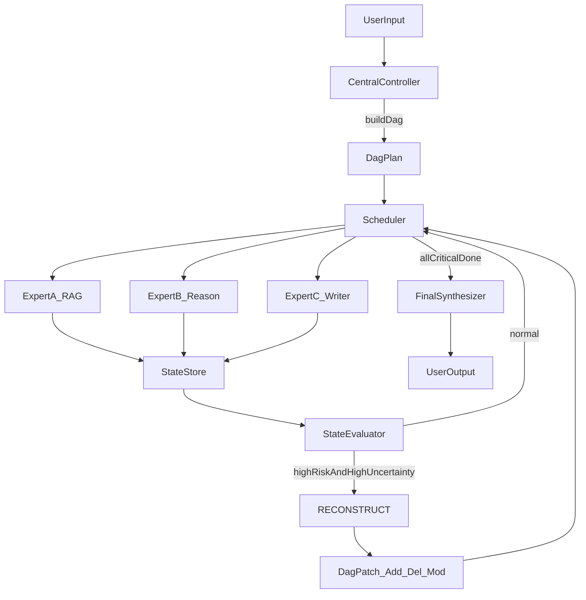

# 中心控制器 + 专家ABC 反应式协作框架（参考方案）

## 1) 目标与前提

- 统一基座模型：[`/root/autodl-tmp/muti-llm/DeepSeek-R1`](/root/autodl-tmp/muti-llm/DeepSeek-R1)。
- 多 GPU 部署，采用多进程服务化（中心与专家解耦），通过结构化协议通信。
- 数据基线沿用 [`/root/autodl-tmp/muti-llm/preprocess_multimodel_data.py`](/root/autodl-tmp/muti-llm/preprocess_multimodel_data.py) 产出的四类 JSONL：A 检索、A 生成、B 推理、C 表达。

## 2) 总体架构（静态规划 + 动态重规划）

- **中心控制器**职责：`DAG规划 -> 路由调度 -> 状态评估 -> 触发RECONSTRUCT -> 收敛输出`。
- **专家A/B/C**职责：A 提供“可引用事实”，B 提供“可校验推理”，C 提供“忠实表达与格式化输出”。
- **状态存储层**：记录节点执行结果、证据、置信度、预算消耗、失败类型，为重规划和训练归因提供依据。

## 3) 通信协议（必须强结构化）

建议把中间状态从“自由文本”升级为统一 schema（Pydantic/JSON Schema）：

- **NodeState**：`nodeId`, `taskType`, `dependencies`, `status`, `confidence`, `riskScore`, `uncertainty`, `budgetUsed`, `budgetLeft`。
- **ExpertOutput**：
  - 通用：`summary`, `confidence`, `errorCode`, `nextHint`。
  - A 专属：`claims[]`, `evidences[]`, `sourceRefs[]`, `citationConfidence`。
  - B 专属：`reasoningSteps[]`, `verifications[]`, `checkResult`。
  - C 专属：`draft`, `fidelityReport`, `unsupportedStatements[]`。
- **ReconstructPatch**：`op`(`add`/`remove`/`modify`), `targetNode`, `newDependencies`, `reason`, `expectedGain`, `costImpact`。

要点：控制器只消费结构化字段，展示给用户时再由 C 转写自然语言。

## 4) 执行循环（核心控制逻辑）

1. **初始化规划**：中心模型输出初始 DAG（节点优先级、依赖、每节点 token/time 预算）。
2. **调度执行**：按依赖拓扑和预算约束分发到 A/B/C，可并行执行独立节点。
3. **状态评估**：每轮子任务完成后，评估 `riskScore`、`uncertainty`、`progressDelta`、`budgetBurnRate`。
4. **触发重规划**：满足“双阈值 + 防抖”才触发 RECONSTRUCT（见下一节）。
5. **收敛判定**：关键节点达标且冲突项清零，进入最终汇总；否则继续循环直到达到最大轮数。

## 5) RECONSTRUCT 触发与防震荡机制（重点）

### 双阈值触发

仅在以下条件同时满足时触发：
- `riskScore >= T_risk`
- `uncertainty >= T_uncertainty`

### 防震荡保护

- **冷却时间**：连续两次 RECONSTRUCT 至少间隔 `cooldownSteps`。
- **最小改动原则**：单次 patch 的新增/删改节点数受上限约束。
- **进度守恒检查**：若最近两轮 `progressDelta` 为正且稳定，不允许重规划。
- **重规划预算**：超出 `reconstructBudget` 直接降级为“局部修复”而非全图改写。

## 6) 你列出的四大风险，对应落地方案

- **信用分配困难**：建立分段评分与节点级日志，区分“规划错/路由错/专家错/聚合错”。
- **重规划震荡**：执行“双阈值+冷却+最小改动+预算上限”。
- **协议不严格**：中间层只允许 schema，不允许自由文本直传。
- **成本时延膨胀**：每节点显式 budget + 早停规则 + 低置信度二次复核门控。

## 7) 训练方案（控制器 SFT + DPO）

### 控制器训练

- **SFT阶段**：使用 GPT-4 合成轨迹 + 人工筛选轨迹，覆盖：
  - 正常 DAG 规划样例
  - 异常识别样例
  - 失败轨迹与修复轨迹（必须加入）
- **DPO阶段**：基于高温采样轨迹构造偏好对，优先比较：
  - 低重规划频率 > 高频重规划
  - 短路径成功 > 长路径成功
  - 可解释 DAG > 黑盒 DAG
- **多目标奖励维度**：`taskSuccess`, `factAccuracy`, `avgReconstructCount`, `latency`, `cost`。

### 专家训练

- **A（RAG事实）**：
  - 检索质量优先（召回/精排/证据覆盖）；
  - 输出必须附 `sourceRefs + citationConfidence`。
- **B（逻辑推理）**：
  - LoRA 微调 CoT 任务；
  - 引入可执行校验（数学验算、代码运行、单元测试）。
- **C（表达生成）**：
  - LoRA 微调表达风格与结构化写作；
  - 加“忠实性约束”，仅允许使用 A/B 的结构化字段，禁止无依据扩写。

## 8) 评测与观测（上线前必须具备）

- **离线评测**：任务成功率、事实一致性、推理可验证率、平均重规划次数、P95 时延、token 成本。
- **在线观测**：请求级 trace（controller decision -> expert output -> reconstruct patch）。
- **回流闭环**：失败样例自动沉淀为 SFT/DPO 增量数据，按周迭代。

## 9) 分阶段落地路线

- **Phase 1（可运行原型）**：统一协议 + 中心循环 + 单次 RECONSTRUCT + 基础日志。
- **Phase 2（稳定性）**：双阈值与防震荡、节点级归因评分、预算感知调度。
- **Phase 3（训练增强）**：控制器 SFT+DPO、A/B/C 专项强化、上线 A/B 测试。

## 10) 关键实现文件建议

- 控制与协议：[`/root/autodl-tmp/muti-llm/orchestrator/protocol.py`](/root/autodl-tmp/muti-llm/orchestrator/protocol.py)
- 调度与重规划：[`/root/autodl-tmp/muti-llm/orchestrator/controller.py`](/root/autodl-tmp/muti-llm/orchestrator/controller.py)
- 状态评估与触发器：[`/root/autodl-tmp/muti-llm/orchestrator/evaluator.py`](/root/autodl-tmp/muti-llm/orchestrator/evaluator.py)
- 专家适配层：[`/root/autodl-tmp/muti-llm/orchestrator/experts.py`](/root/autodl-tmp/muti-llm/orchestrator/experts.py)
- 可观测性与回流：[`/root/autodl-tmp/muti-llm/orchestrator/trace.py`](/root/autodl-tmp/muti-llm/orchestrator/trace.py)

该方案重点不是“多模型并行调用”本身，而是把 **重规划条件、结构化协议、归因训练闭环** 先做扎实，这样后续 SFT/DPO 才会稳定放大收益。

## 11) Phase 1 最小可运行实现清单（可直接开工）

### 11.1 目录与文件

- [`/root/autodl-tmp/muti-llm/orchestrator/protocol.py`](/root/autodl-tmp/muti-llm/orchestrator/protocol.py)
  - 定义 `TaskNode`, `DagPlan`, `ExpertRequest`, `ExpertResponse`, `NodeState`, `ReconstructPatch`。
  - 提供 `validate_*` 方法，强制字段完整性与枚举合法性。
- [`/root/autodl-tmp/muti-llm/orchestrator/controller.py`](/root/autodl-tmp/muti-llm/orchestrator/controller.py)
  - 实现主循环：`build_plan() -> dispatch() -> evaluate() -> maybe_reconstruct() -> finalize()`。
  - 维护 `run_id` 与每个 `node_id` 的状态机。
- [`/root/autodl-tmp/muti-llm/orchestrator/evaluator.py`](/root/autodl-tmp/muti-llm/orchestrator/evaluator.py)
  - 计算 `riskScore`, `uncertainty`, `progressDelta`, `budgetBurnRate`。
  - 输出是否触发 `RECONSTRUCT` 与触发原因。
- [`/root/autodl-tmp/muti-llm/orchestrator/experts.py`](/root/autodl-tmp/muti-llm/orchestrator/experts.py)
  - A/B/C 三个适配器，统一 `run(expert_request)->expert_response` 接口。
  - 内部封装 OpenAI-compatible API 调用（vLLM）。
- [`/root/autodl-tmp/muti-llm/orchestrator/trace.py`](/root/autodl-tmp/muti-llm/orchestrator/trace.py)
  - 写入 JSONL trace：`controller_decision`, `expert_call`, `expert_result`, `reconstruct_patch`, `final_answer`。
- [`/root/autodl-tmp/muti-llm/orchestrator/cli.py`](/root/autodl-tmp/muti-llm/orchestrator/cli.py)
  - `python -m orchestrator.cli --query "..." --max-steps 12` 单命令联调。

### 11.2 最小协议（v1）

- `TaskNode`
  - `nodeId: str`
  - `taskType: Literal["retrieve", "reason", "write", "verify"]`
  - `expert: Literal["A", "B", "C"]`
  - `dependencies: list[str]`
  - `inputRefs: list[str]`
  - `budget: {maxTokens:int, maxSeconds:int}`
- `NodeState`
  - `status: Literal["pending", "running", "done", "failed", "skipped"]`
  - `confidence: float`
  - `riskScore: float`
  - `uncertainty: float`
  - `artifactRef: str`
- `ReconstructPatch`
  - `op: Literal["add", "remove", "modify"]`
  - `targetNode: str`
  - `reason: str`
  - `expectedGain: float`
  - `costImpact: float`

### 11.3 RECONSTRUCT v1 策略参数（建议初值）

- `T_risk = 0.70`
- `T_uncertainty = 0.60`
- `cooldownSteps = 2`
- `maxPatchOpsPerRound = 2`
- `maxReconstructTimes = 3`
- `reconstructBudgetRatio = 0.25`（重规划最多消耗总 budget 的 25%）

### 11.4 验收标准（Phase 1 Done）

- 能处理 3 类任务：事实问答、数学推理、总结写作。
- 每次请求都产出完整 trace JSONL，能回放到节点级。
- 至少出现一次 RECONSTRUCT 并成功收敛，不发生重规划震荡。
- 控制器输出决策 JSON 的可解析率 >= 99%（含重试后）。
- 相比“单次静态 DAG 不重规划”基线，复杂任务成功率有可见提升。

### 11.5 最小实验矩阵（上线前）

- `baseline_static`: 中心只规划一次，不允许重规划。
- `reactive_v1`: 双阈值 + 冷却 + 最小改动。
- `reactive_v1_no_budget`: 去掉预算约束，观察时延和成本劣化。

输出指标统一对比：`successRate`, `factAcc`, `avgReconstructCount`, `p95Latency`, `avgCost`。
