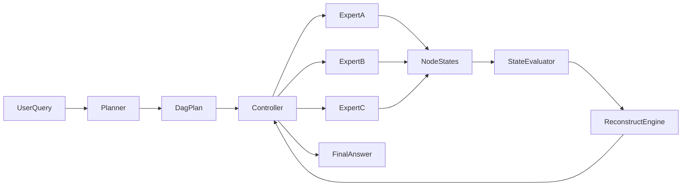

# Orchestrator 模型架构汇报文档（教师版）

## 1. 研究动机与问题定义

### 1.1 背景

在复杂任务（如数学推理、跨领域问答、事实检索+推理+写作）中，单次调用大模型通常会暴露两个核心问题：

- 输出稳定性不足：同类问题多次调用结果波动明显，容易出现逻辑跳步、事实遗漏或结构不一致。
- 推理成本较高：将检索、推理、校验、写作全部压缩到一次调用中，token 消耗和失败重试成本都较大。

因此，本项目设计了 `orchestrator` 作为编排层，不再依赖“单次大调用一次出最终答案”，而是采用“任务分解 -> 多专家协同 -> 运行时评估 -> 必要时重规划”的动态执行模式。

### 1.2 目标

`orchestrator` 的核心目标不是单纯“多模型并联”，而是建立一个可以在执行过程中自我调节的控制闭环：

- 将复杂问题拆解为可执行 DAG 子任务；
- 按依赖关系调度专家执行；
- 实时评估状态风险与不确定性；
- 在必要时对失败路径进行结构化重规划；
- 在质量和成本之间实现更可控的折中。

---

## 2. 总体架构

### 2.1 架构总览

系统由五个核心层组成：

1. **Planner 层**：输入原始 query，输出初始 `DagPlan`。
2. **Controller 层**：按 DAG 依赖驱动执行，维护状态机与产物。
3. **Expert 层（A/B/C）**：承担不同类型任务（检索、推理、写作等）。
4. **Evaluator 层**：聚合运行状态，计算是否触发重规划。
5. **Reconstruct 机制**：在不满足质量门限时执行 patch 或子图替换。

可用下面的流程图展示：

### 2.2 代码映射

- 规划器与重规划提案：`/root/autodl-tmp/muti-llm/orchestrator/planner.py`
- 控制器主循环：`/root/autodl-tmp/muti-llm/orchestrator/controller.py`
- 协议与数据结构：`/root/autodl-tmp/muti-llm/orchestrator/protocol.py`
- 专家适配层：`/root/autodl-tmp/muti-llm/orchestrator/experts.py`
- 评估器：`/root/autodl-tmp/muti-llm/orchestrator/evaluator.py`
- 运行入口装配：`/root/autodl-tmp/muti-llm/orchestrator/stack.py`

---

## 3. 核心协议设计（Data Contract）

`protocol.py` 定义了系统运行时的“统一语言”，使规划、执行、评估、重规划互相解耦但保持可组合性。

### 3.1 任务抽象

- `TaskType`：`retrieve / reason / write / verify`
- `ExpertName`：`A / B / C`
- `TaskNode`：最小可执行单元，包含：
  - `node_id`
  - `task_type`
  - `expert`
  - `dependencies`（前置节点）
  - `input_refs`（上下文引用）
  - `budget`（`max_tokens`、`max_seconds`）

### 3.2 计划抽象

- `DagPlan`：节点集合构成的有向无环图
- 内置 `validate()`：
  - 节点唯一性检查
  - 依赖合法性检查
  - 无环性检查

### 3.3 运行状态抽象

- `NodeState`：
  - `status`：`pending/running/done/failed/skipped`
  - `confidence`
  - `risk_score`
  - `uncertainty`
  - `artifact_ref`
  - `error_code`

这个状态结构是后续评估与重规划决策的直接输入。

### 3.4 重规划抽象

- `ReconstructPatch`：节点级操作（`add/remove/modify`）
- `SubgraphReplacementPlan`：子图级替换方案，包含：
  - 替换根节点 `replace_root_node`
  - 删除集合 `remove_node_ids`
  - 新增节点 `new_nodes`
  - 桥接依赖 `bridge_dependencies`
  - 预期收益/成本 `expected_gain/cost_impact`

---

## 4. 执行主循环（Controller Runtime Loop）

`controller.py` 的 `run(query)` 是系统行为主干。其逻辑可以概括为“初始化 -> 迭代执行 -> 评估重规划 -> 终止汇总”。

### 4.1 初始化阶段

1. 记录 `run_start` 事件；
2. 调用 planner 生成初始 DAG（`build_initial_plan`）；
3. 初始化所有节点状态为 `PENDING`；
4. 初始化运行计数器（重规划轮数、专家调用次数、重规划成本等）。

### 4.2 每步迭代阶段

对 `step in [1, max_steps]`：

1. 计算 ready 节点（依赖全部完成的 `PENDING` 节点）；
2. 分发执行 `_dispatch_node`：
   - 构造 `ExpertRequest`
   - 通过 `ExpertRegistry` 路由到 A/B/C
   - 回收 `ExpertResponse` 并校验
3. 更新节点状态 `_update_state`：
   - 成功 -> `DONE`，风险与不确定性下降
   - 失败 -> `FAILED`，风险与不确定性上升
4. 调用 Evaluator 进行重规划判定；
5. 若触发重规划，进入 reconstruct 分支（节点级或子图级）；
6. 若全部节点已完成或跳过，则提前终止循环。

### 4.3 终止与输出

循环结束后：

- 执行 `_synthesize_final_answer` 汇总产物；
- 记录 `final_answer` 与 `run_summary`；
- 返回结构化结果（包含 `finalAnswer`、`states`、`durationMs`、`reconstructRounds` 等字段）。

---

## 5. 评估机制（Evaluator）

`evaluator.py` 的职责是把“局部节点状态”汇聚为“全局是否要改计划”的决策。

### 5.1 风险聚合

风险由两部分组成：

- 失败比例（`failed / total`）
- 已完成节点平均置信度（`1 - avg_conf_done`）

采用加权组合形成总体 `risk`，并对失败场景做高风险下限提升，以避免失败被大量 `PENDING` 节点稀释。

### 5.2 不确定性聚合

不确定性取各节点 `uncertainty` 的平均值，表征整体答案可靠性波动。

### 5.3 决策门控

是否重规划由四个条件共同决定：

1. 未超过最大重规划次数；
2. 不在冷却窗口；
3. 风险超过阈值 `t_risk`；
4. 不确定性超过阈值 `t_uncertainty`。

满足时输出 `should_reconstruct = True`，并给出原因。

---

## 6. 重规划机制（Reconstruct）

重规划是该架构的关键能力，用于在运行中修正路径，而不是整图重跑。

### 6.1 节点级重规划（Patch）

由 planner 提供候选 patch，控制器按预算应用：

- `ADD`：新增重试节点，替代失败节点后续依赖；
- `MODIFY`：原位修改节点（如切换专家、提高预算）；
- `REMOVE`：删除失效叶子节点并重接依赖。

控制器会检查：

- patch 是否可应用；
- 每轮 patch 数是否超过上限；
- 累计 `cost_impact` 是否超过 reconstruct 成本预算。

### 6.2 子图级重规划（Subgraph Replacement）

当失败影响具有连锁性时，系统优先尝试子图替换：

1. 识别失败根节点及其后代形成故障子图；
2. planner 生成替换方案（删除旧子图 + 插入新子图）；
3. 校验新依赖闭包合法性与无环性；
4. 按预算落地并将新节点状态重置为 `PENDING`。

### 6.3 成本控制

重规划不是无限触发，受三重约束：

- 轮数上限 `max_reconstruct_times`
- 每轮操作上限 `max_patch_ops_per_round`
- 累计成本上限 `reconstruct_budget_ratio * max_steps`

这保证系统在“持续修复能力”和“执行成本可控”之间保持平衡。

---

## 7. 专家协同机制（Expert Layer）

`experts.py` 提供统一适配接口，让控制器只关心“任务与状态”，不关心具体模型调用细节。

### 7.1 统一适配接口

- `BaseExpertAdapter.run(request) -> ExpertResponse`
- `ExpertRegistry.get(expert_name)` 实现 A/B/C 路由

### 7.2 双后端能力

- `MockExpertAdapter`：本地调试、可复现失败场景
- `OpenAIExpertAdapter`：对接 OpenAI 兼容推理服务

### 7.3 结构化返回契约

A/B/C 专家分别对应不同 JSON schema：

- A：事实检索与依据（claims/sourceRefs/citationConfidence）
- B：推理与校验轨迹（reasoningSteps/verifications/checkResult）
- C：写作与忠实性报告（draft/fidelityReport/unsupportedStatements）

这种“按职责约束输出结构”的设计，能减少跨专家数据对接时的信息损耗。

---

## 8. 可扩展性与研究价值

从系统设计角度，`orchestrator` 的可扩展性体现在三层：

1. **任务层扩展**：可新增任务类型（例如工具调用、代码执行、外部检索）并映射到新专家。
2. **专家层扩展**：可按领域引入更多专家（数学、金融、法律等），复用同一控制器。
3. **策略层扩展**：可替换评估函数、重规划策略、预算函数，进行策略对比实验。

从研究角度，它提供了一个可实验的“动态编排框架”：

- 可研究不同 risk/uncertainty 聚合策略对质量与成本的影响；
- 可研究 patch 与子图替换在不同失败模式下的收益差异；
- 可研究规划模型与专家模型异构组合的稳定性边界。

---

## 9. 结论

`orchestrator` 的核心贡献在于把“模型调用”提升为“受控执行过程”：

- 用 DAG 将复杂任务拆分为可管理单元；
- 用状态评估实现运行中质量感知；
- 用重规划机制对失败路径进行结构化修复；
- 用预算约束控制额外开销。

因此，该架构更适合复杂任务场景下对稳定性、可控性与可扩展性有要求的系统落地。
